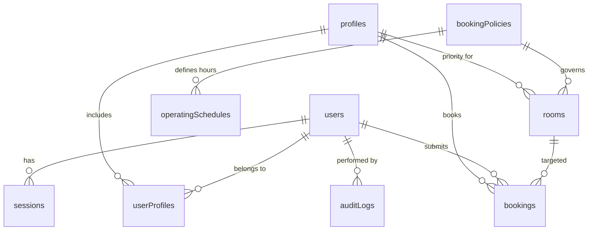
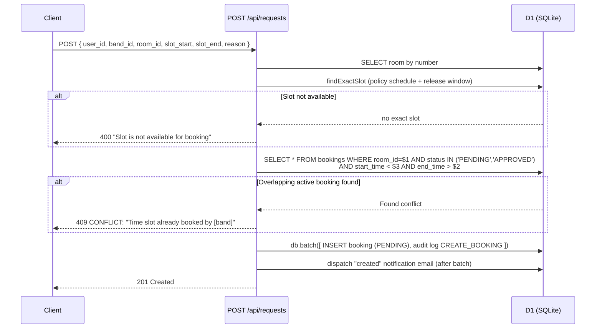

# Music Room Management System — Architecture Guide

## 1. Project Overview

A full-stack web application for managing music room bookings, slot requests, and user administration at **SWO Kengeri Campus**. Students/staff can view room availability and submit booking requests; admins manage approvals, slot configuration, and bands.

### User Personas

| Role | Capabilities |
|------|-------------|
| **Visitor** (unauthenticated) | View the timetable at `/RoomBooking`, see the landing page at `/home`, sign in |
| **User** (authenticated) | Submit booking requests, view own requests, delete own requests |
| **Admin** (`role: "admin"`) | Approve/deny requests, manage slot configs, manage users/bands |

---

## 2. Tech Stack

| Layer | Technology | Purpose |
|-------|------------|---------|
| **Framework** | Next.js 15 (App Router) | React framework with SSR and route rewriting |
| **Language** | TypeScript | Type safety throughout |
| **Backend API** | Hono (Cloudflare Workers) | Serves `/api/*`, handles auth and business logic |
| **Database** | Cloudflare D1 (SQLite) | Relational data with time-range queries |
| **ORM** | Drizzle ORM | Type-safe SQL with schema validation |
| **Auth** | JWT (`jose`) | HttpOnly cookie sessions, per-route middleware guard |
| **Styling** | Tailwind CSS 3 | Utility-first CSS with custom glassmorphism design |
| **Animation** | Framer Motion 11 | UI transitions, modals, dropdowns, page loading |
| **Date/Time** | date-fns 4 | Calendar calculations, formatting |
| **Testing** | Vitest + Playwright | Backend unit tests + API/UI tests |
| **Deployment** | Vercel (frontend) + Cloudflare Workers (backend) | Serverless hosting |

---

## 3. Architecture Overview

```
┌─────────────────────────────────────────────────────────────────────┐
│                           Browser                                   │
│  ┌──────────┐  ┌──────────┐  ┌───────────┐  ┌───────────────────┐ │
│  │ Visitor  │  │  User    │  │  Admin    │  │  Mobile Device    │ │
│  └────┬─────┘  └────┬─────┘  └─────┬─────┘  └────────┬──────────┘ │
│       │              │              │                   │            │
│       └──────────────┴──────────────┴───────────────────┘            │
│                              │                                      │
│                              ▼                                      │
│                     ┌────────────────┐                              │
│                     │  Next.js App   │                              │
│                     │  (App Router)  │                              │
│                     └───────┬────────┘                              │
└─────────────────────────────┼────────────────────────────────────────┘
                              │
              ┌───────────────┼───────────────────┐
              │               │                   │
              ▼               ▼                   ▼
     ┌─────────────────┐ ┌────────────┐ ┌──────────────────┐
     │   middleware.ts  │ │ Static UI  │ │   Backend API    │
     │ (route auth)     │ │ Components │ │   (Hono/Wrangler)│
     └────────┬────────┘ └────────────┘ └────────┬─────────┘
              │                                │
              │ (JWT check)                     │ (proxy via /api rewrite)
              ▼                                ▼
     ┌────────────────┐              ┌──────────────────┐
     │   jose JWT     │              │  Drizzle ORM     │
     │  verification  │              │  (D1 / sqlite)   │
     └────────────────┘              └────────┬─────────┘
                                             │
                                             ▼
                                  ┌──────────────────┐
                                  │   Cloudflare D1  │
                                  └──────────────────┘
```

### Request Lifecycle

1. **Page request** — Next.js resolves the route, `middleware.ts` checks JWT (if applicable)
2. **API request** — Client calls `/api/*`, which Next.js rewrites to the Hono backend (default `http://localhost:8787`); the backend validates the JWT and queries D1 via Drizzle ORM
3. **Booking write** — POST/PUT to `/api/requests` runs a conflict-overlap check and a `db.batch(...)` insert, relying on the `bookings_room_start_unique` unique index to prevent double-booking
4. **Response** — API returns JSON; React components update optimistically

---

## 4. Directory Structure

```
├── app/                              # Next.js App Router pages
│   ├── (root)/
│   │   ├── layout.tsx                # Root layout: Geist fonts, Providers, ForcePasswordChange
│   │   ├── Dashboard/                # Slot configuration (admin)
│   │   ├── Register/                 # User & band management (admin)
│   │   ├── RoomBooking/              # Room timetable (public)
│   │   ├── SlotRequests/             # Slot request approval (auth required)
│   │   └── home/                     # Landing page (public)
│   │   └── page.tsx                  # Redirects / → /RoomBooking
│   ├── globals.css                   # Tailwind + dark theme utilities
│   ├── providers.tsx                 # AuthProvider + ThemeProvider
│   └── fonts/                        # Geist font files
│
├── backend/                          # Hono API (Cloudflare Workers + D1)
│   ├── src/
│   │   ├── db/                       # Drizzle schema + client + repositories
│   │   ├── features/                 # auth, users, bands, rooms, slotconfig, slots, requests, entrylogs, settings, sheets
│   │   ├── middleware/               # auth + rate-limit middleware
│   │   ├── sheets/                   # Weekly Google Sheets export (grid, service-account JWT, time)
│   │   ├── email/                    # Booking notification emails (raw SMTP via Cloudflare Sockets)
│   │   ├── audit/                    # audit_logs helper
│   │   ├── lib/                      # jwt, password helpers
│   │   └── index.ts                  # Hono app + route mounting
│   ├── drizzle/                      # Drizzle migration SQL files
│   ├── scripts/                      # Dev harnesses (weekly-sheet dry run)
│   ├── drizzle.config.ts             # Drizzle Kit configuration (D1)
│   ├── wrangler.json                 # Worker config: D1 binding, JWT secret, cron trigger
│   └── package.json                  # Backend deps + scripts
│
├── components/
│   ├── Navbar.tsx                    # Top nav: links, login/logout, mobile hamburger (per-page, no SSR)
│   ├── Branches.tsx                  # Branch info section (home page)
│   ├── Hero.tsx                      # Hero section with glowing stars
│   ├── Mission.tsx                   # Mission statement section
│   ├── ui/
│   │   ├── RBTable.tsx               # Room booking timetable (core component)
│   │   ├── SlotsRequestTable.tsx     # Request management table
│   │   ├── DashboardTable.tsx        # Slot config CRUD table
│   │   ├── Modal.tsx                 # Reusable glassmorphism modal
│   │   ├── TimePicker.tsx            # 12-hour time dropdown (06:00–21:00)
│   │   ├── DatePicker.tsx            # Client-side calendar popover
│   │   ├── ColorPicker.tsx           # HSV canvas + hex input
│   │   ├── BandMultiSelect.tsx       # Multi-band select with checkboxes
│   │   ├── ProfileDropdown.tsx       # Single-band select with colour dots
│   │   ├── RoomDropdown.tsx          # Numeric room selector
│   │   ├── FilterDropdown.tsx        # Generic filter dropdown
│   │   ├── ForcePasswordChange.tsx   # Forced first-login password change modal
│   │   ├── NotificationSettings.tsx  # Admin notification-email settings card
│   │   ├── WeeklySheetSettings.tsx   # Google Sheets config + manual export
│   │   ├── MotionWrapper.tsx         # Fade-in animation wrapper
│   │   ├── MagicButton.tsx           # Shimmer-animated button
│   │   ├── events.tsx               # Event cards with scroll reveal
│   │   ├── focus-cards.tsx           # Hover-reactive image grid
│   │   ├── glowing-stars.tsx         # Animated star background
│   │   ├── background-gradient.tsx   # Animated gradient container
│   │   └── text-generate-effect.tsx  # Word-by-word reveal
│   └── ...
│
├── tests/
│   ├── auth.setup.ts                 # Playwright auth fixture (logs in admin)
│   ├── *-api.test.mjs                # API test suites
│   ├── *-ui.spec.ts                  # Playwright UI tests
│   └── responsive-ui.spec.ts         # Mobile/tablet viewport tests
│
├── middleware.ts                      # Route-level JWT auth guard
├── playwright.config.ts               # Playwright config (6 projects)
├── vercel.json                        # Vercel deployment config
├── next.config.ts                     # Next.js configuration (rewrites /api/* to backend)
├── tailwind.config.ts                 # Tailwind CSS configuration
└── lib/utils.ts                       # cn() helper (clsx + tailwind-merge)
```

---

## 5. Database Schema

Cloudflare D1 (SQLite) via Drizzle ORM. All tables live in `backend/src/db/schema.ts`.

### Entity Relationship Diagram



### Table Details

#### `users`
| Column | Type | Constraints |
|--------|------|-------------|
| `id` | `text` | PK |
| `username` | `text` | NOT NULL, UNIQUE |
| `email` | `text` | NOT NULL, UNIQUE, default `''` |
| `name` | `text` | NOT NULL, default `''` |
| `password_hash` | `text` | NOT NULL |
| `role` | `text` | NOT NULL (`USER` \| `ADMIN`) |
| `must_change_password` | `integer` (bool) | NOT NULL, default `true` |
| `active` | `integer` (bool) | NOT NULL, default `true` |
| `created_at` | `integer` (epoch) | NOT NULL |
| `updated_at` | `integer` (epoch) | NOT NULL |

#### `profiles`
| Column | Type | Constraints |
|--------|------|-------------|
| `id` | `text` | PK |
| `name` | `text` | NOT NULL, UNIQUE |
| `color` | `text` | NOT NULL, default `#4F46E5` |
| `created_at` | `integer` (epoch) | NOT NULL |

#### `user_profiles` (many-to-many join)
| Column | Type | Constraints |
|--------|------|-------------|
| `user_id` | `text` | NOT NULL, FK → `users.id` ON DELETE CASCADE |
| `profile_id` | `text` | NOT NULL, FK → `profiles.id` ON DELETE CASCADE |
| **PK** | | `(user_id, profile_id)` composite |

#### `booking_policies`
| Column | Type | Constraints |
|--------|------|-------------|
| `id` | `text` | PK |
| `name` | `text` | NOT NULL, UNIQUE |
| `booking_horizon_days` | `integer` | NOT NULL |
| `min_booking_duration_minutes` | `integer` | NOT NULL |
| `max_booking_duration_minutes` | `integer` | NOT NULL |
| `booking_interval_minutes` | `integer` | NOT NULL |
| `active` | `integer` (bool) | NOT NULL, default `true` |

#### `operating_schedules`
| Column | Type | Constraints |
|--------|------|-------------|
| `id` | `text` | PK |
| `policy_id` | `text` | NOT NULL, FK → `booking_policies.id` ON DELETE CASCADE |
| `day_of_week` | `integer` | NOT NULL |
| `start_time` | `text` | NOT NULL (`HH:mm`) |
| `end_time` | `text` | NOT NULL (`HH:mm`) |
| `enabled` | `integer` (bool) | NOT NULL, default `true` |

#### `system_settings`
| Column | Type | Constraints |
|--------|------|-------------|
| `id` | `text` | PK |
| `booking_release_day` | `integer` | NOT NULL |
| `booking_release_time` | `text` | NOT NULL |
| `default_policy_id` | `text` | NOT NULL, FK → `booking_policies.id` |
| `notification_email` | `text` | nullable |
| `sheets_spreadsheet_id` | `text` | nullable |
| `sheets_sheet_name` | `text` | nullable |

#### `rooms`
| Column | Type | Constraints |
|--------|------|-------------|
| `id` | `text` | PK |
| `name` | `text` | NOT NULL, UNIQUE |
| `number` | `integer` | UNIQUE, nullable |
| `created_at` | `integer` (epoch) | NOT NULL |
| `active` | `integer` (bool) | NOT NULL, default `true` |
| `policy_id` | `text` | FK → `booking_policies.id`, nullable |
| `priority_profile_id` | `text` | FK → `profiles.id`, nullable |

**Index:** `rooms_number_unique` on `(number)`.

#### `bookings`
| Column | Type | Constraints |
|--------|------|-------------|
| `id` | `text` | PK |
| `room_id` | `text` | NOT NULL, FK → `rooms.id` ON DELETE CASCADE |
| `profile_id` | `text` | NOT NULL, FK → `profiles.id` ON DELETE CASCADE |
| `user_id` | `text` | NOT NULL, FK → `users.id` ON DELETE CASCADE |
| `start_time` | `integer` (epoch) | NOT NULL |
| `end_time` | `integer` (epoch) | NOT NULL |
| `status` | `text` | NOT NULL (`PENDING` \| `APPROVED` \| `REJECTED` \| `CANCELLED`), default `PENDING` |
| `reason` | `text` | nullable |
| `approved_by` | `text` | FK → `users.id` ON DELETE SET NULL, nullable |
| `approved_at` | `integer` (epoch) | nullable |
| `created_at` | `integer` (epoch) | NOT NULL |

**Indexes:** `bookings_room_time_idx` on `(room_id, start_time, end_time)`, `bookings_profile_idx` on `(profile_id)`, and `bookings_room_start_unique` UNIQUE on `(room_id, start_time)`.

#### `sessions`
| Column | Type | Constraints |
|--------|------|-------------|
| `id` | `text` | PK |
| `user_id` | `text` | NOT NULL, FK → `users.id` ON DELETE CASCADE |
| `created_at` | `integer` (epoch) | NOT NULL |
| `last_seen_at` | `integer` (epoch) | NOT NULL |
| `expires_at` | `integer` (epoch) | NOT NULL |
| `revoked` | `integer` (bool) | NOT NULL, default `false` |

#### `audit_logs`
| Column | Type | Constraints |
|--------|------|-------------|
| `id` | `text` | PK |
| `actor_id` | `text` | FK → `users.id` ON DELETE SET NULL, nullable |
| `action` | `text` | NOT NULL |
| `target_type` | `text` | NOT NULL |
| `target_id` | `text` | nullable |
| `metadata` | `text` (JSON) | NOT NULL |
| `created_at` | `integer` (epoch) | NOT NULL |

---

## 6. Authentication & Authorization

### Backend JWT Auth (`backend/src/features/auth/`)

- **Login:** `POST /api/auth/login` — validates credentials (username **or** email) against `users`, compares via `bcryptjs`, creates a `sessions` row, and sets an HttpOnly cookie (`token`) signed with `jose` using `JWT_SECRET`
- **Registration:** `POST /api/auth/register` — admin-only (requires auth + password changed + admin role); new users start with the `changeit` default password and `must_change_password = true`
- **Logout:** `POST /api/auth/logout` — revokes the session and clears the cookie
- **Me:** `GET /api/auth/me` — returns the current user with their profiles
- **Change password:** `PATCH /api/auth/me/password` — requires the current password; clears `must_change_password`

### Forced Password Change Flow

1. New users are created (admin-only `POST /api/auth/register`) with `must_change_password = true` and password `changeit`
2. Every protected endpoint (except logout and password change) is gated by `requirePasswordChanged()`, which returns **403** while the flag is set
3. The frontend `ForcePasswordChange` modal (mounted in `app/(root)/layout.tsx`) appears whenever `session.user.mustChangePassword === true`; it is non-dismissible until the user completes `PATCH /api/auth/me/password`

### JWT Flow

```
login(identifier, password)
  ├─ Query user by username OR email
  ├─ bcrypt.compare(password, password_hash)
  ├─ Create session row (expires 24h)
  ├─ Sign JWT with jose (JWT_SECRET)
  └─ Set HttpOnly cookie "token"
        │
middleware (next) ── verify JWT on every non-public route
backend middleware ── requireAuth() verifies JWT + loads user/session
```

### Middleware Route Protection (`middleware.ts`)

`middleware.ts` verifies the JWT on every request using `jose`. The `matcher` config defines which routes require authentication:

```typescript
matcher: ["/((?!api|_next/static|_next/image|favicon.ico|home|RoomBooking|.*\\.(?:png|jpg|jpeg|gif|svg|webp|ico|css|js|woff2?|ttf|eot|mp4|webm)$).+)"]
```

| Route | Public | Notes |
|-------|--------|-------|
| `/` | ✅ | Redirects to `/RoomBooking` |
| `/RoomBooking` | ✅ | Timetable viewable by anyone |
| `/home` | ✅ | Landing page |
| `/api/*` | ✅ | Backend handles its own auth |
| `/SlotRequests` | ❌ | Any signed-in user; approve/deny gated on `role === "admin"` in the table |
| `/Dashboard` | ❌ | Requires auth + admin role check in component |
| `/Register` | ❌ | Requires auth + admin role check in component |

Unauthenticated requests to protected routes redirect to `/home?callbackUrl=...`. Admin pages additionally redirect to `/` when a non-admin is signed in.

### Frontend Role Checks

Components check `user?.role === 'admin'` (from the `AuthProvider` context in `lib/auth.tsx`):
- **Navbar**: Admin-only links (`/Register`, `/Dashboard`) are hidden from non-admins
- **SlotsRequestTable**: Approve/deny/edit buttons only visible when `isAdmin` is true
- **RBTable**: Booking modal doesn't show admin-only fields for non-admins; non-admins book with their own band automatically
- **Dashboard/Register pages**: Check role before rendering, redirect to `/` otherwise

---

## 7. API Routes Reference

All routes live in the Hono backend (`backend/src/features/*`) and are mounted under `/api`. Next.js rewrites `/api/*` to the backend URL.

### `/api/auth` — login, register, logout, me, password

| Endpoint | Method | Auth | Description |
|----------|--------|------|-------------|
| `/api/auth/login` | POST | — | Login with username/email + password → HttpOnly `token` cookie |
| `/api/auth/register` | POST | admin | Create user (default password `changeit`, `must_change_password = true`) |
| `/api/auth/logout` | POST | auth | Revoke session + clear cookie |
| `/api/auth/me` | GET | auth | Current user + profiles |
| `/api/auth/me/password` | PATCH | auth | Change own password (clears `must_change_password`) |

### `/api/users` — GET, PUT, DELETE (admin)

GET lists users with their linked bands; PUT updates a user (name, email, role, band links) via `?id=`; DELETE removes a user via `?id=`.

### `/api/bands` — GET, POST, PUT, DELETE

GET is public and returns bands with a `colour` field (mapped from `color`). POST creates a band (default colour `#4F46E5`); PUT/DELETE use `?id=`. Writes are admin-only (auth + password-changed + admin).

### `/api/rooms` — GET (public)

Returns active rooms ordered by `number ASC, name`.

### `/api/slotconfig` — GET, POST, PUT, DELETE

GET is public; writes are admin-only. Because a slot config row is duplicated per day-of-week (7 rows), create/update/delete operate on the whole week: `createSlot` inserts 7 rows, `updateSlot`/`deleteSlot` match on `(policy_id, start_time, end_time)`. PUT sends `id` in the body; DELETE uses `?id=`.

### `/api/slots` — GET (public)

| Query Param | Type | Description |
|------------|------|-------------|
| `start` | number (epoch) | Return bookings with `start_time >= start` |
| `end` | number (epoch) | Return bookings with `start_time <= end` |
| `roomNumber` | integer | Filter by room number |

**Response:** Active bookings (`PENDING`/`APPROVED`) for the given range/room.

### `/api/requests` — GET, POST, PUT, DELETE (auth)

| Endpoint | Method | Auth | Description |
|----------|--------|------|-------------|
| `/api/requests` | GET | auth | List requests; non-admins only see their own (the client's `user_id` filter is ignored for non-admins) |
| `/api/requests` | POST | auth | Create request (conflict detection before insert) |
| `/api/requests?id=...` | PUT | auth | Update request (approve/reject/edit); only admins can change status |
| `/api/requests?id=...` | DELETE | auth | Delete request |

**Create request flow:**
```
1. Resolve room by number
2. Find exact configured slot (via SlotPolicyService) for the requested time
3. Validate booking horizon + policy constraints
4. Check for active conflict (overlapping booking in same room)
   → If found → throw CONFLICT: message with band name
5. db.batch([ insert booking (PENDING), audit log CREATE_BOOKING ]), then dispatch the "created" notification email
```

**Approval flow (status → `"APPROVED"`):**
- Re-checks for conflicts (excluding the request being edited) before approving
- On conflict → 409 with the conflicting band name

**Status model:** DB statuses `PENDING | APPROVED | REJECTED | CANCELLED`; API statuses `pending | approved | denied` (REJECTED and CANCELLED both map to `denied`). `PENDING`/`APPROVED` are the "active" statuses that occupy a slot.

### `/api/entrylogs` — GET, POST (admin)

Registered under the path `/api/entrylogs/entrylogs` (the router is mounted at `/entrylogs` and handlers are declared as `/entrylogs`). GET returns the last 200 `audit_logs` rows; POST writes an `ENTRY_SCAN` audit log entry.

### `/api/system-settings` — GET, PUT (admin)

Reads/writes the single `system_settings` row. Only `notification_email`, `sheets_spreadsheet_id`, and `sheets_sheet_name` are writable; empty strings are stored as `null`.

### `/api/sheets/weekly` — POST (admin)

Manually triggers the weekly Google Sheets export (writes `APPROVED` bookings only). Optional body `{ date }` (ISO) overrides the target week. Also runs automatically via cron (`30 15 * * 0` UTC).

### `/health` — GET (public)

Liveness check returning `{ status: "ok" }`.

---

## 8. Frontend Pages & Components

### Page Summary

| Page | Route | Access | Key Feature |
|------|-------|--------|-------------|
| **Room Booking** | `/RoomBooking` | Public | Weekly timetable, room selector, booking modal |
| **Slot Requests** | `/SlotRequests` | Auth | Approve/deny/edit (admin only), filters, search, pagination |
| **Dashboard** | `/Dashboard` | Admin | Slot config CRUD, notification settings, sheets settings |
| **Register** | `/Register` | Admin | User + band management, ColorPicker, BandMultiSelect |
| **Home** | `/home` | Public | Hero, Mission, Branches, Events sections |
| **Root** | `/` | Public | Redirects to `/RoomBooking` |

### Key Components

#### `Navbar.tsx`
- Fixed top bar, hides on scroll-down, shows on scroll-up
- Desktop links with active indicator; links require auth (`/RoomBooking`, `/SlotRequests`) or admin (`/Dashboard`, `/Register`)
- Mobile hamburger menu with `AnimatePresence` animation
- Inline login `Modal` (no separate registration modal — "Contact an admin")
- Dynamically imported per-page with `ssr: false`

#### `ForcePasswordChange.tsx` (mounted in root layout)
- Non-dismissible modal shown whenever `session.user.mustChangePassword === true`
- Calls `PATCH /api/auth/me/password` with current + new password; refreshes session on success

#### `RBTable.tsx` (Room Booking Table — core component)
- **Week navigation:** prev/next chevrons, "Today" button, date picker trigger
- **Room selector:** `RoomDropdown` to switch between rooms
- **Grid layout:** Rows = time slots (from `slotconfig`), Columns = days of week
- **Booking display:** Cells coloured by band colour, row-span merged for consecutive same-band bookings
- **Booking modal:** Opens on cell click — shows band selector (ProfileDropdown), date+time fields, reason
- **Week cache:** `useRef<Map<string, CacheEntry>>` — max 20 entries, cache-first, cleared on new booking
- **Scroll-edge gradient:** Right-edge gradient overlay when table overflows horizontally
- **Animation:** `AnimatePresence mode="wait"` around table with 0.1s crossfade on week navigation
- Non-admin users book with their own band (auto-selected); admins pick any band

#### `SlotsRequestTable.tsx`
- **Filters:** Room, status (pending/approved/denied), date, text search (matches user or band name)
- **Action buttons:** Admin sees approve/deny/edit; all users see delete
- **Edit modal:** Room/Date/Time in `flex-col sm:flex-row`, Status + Reason full-width
- **Pagination:** 7 per page, ellipsis truncation
- **Error display:** 409 conflict errors show conflicting band name via `formatError`

#### `DashboardTable.tsx`
- **Add row:** Two TimePicker inputs + "Add Slot" button at top
- **Table columns:** ID, Start, End, Status badge, Actions (toggle enabled/disabled, delete)
- **12-hour display:** All times converted via `to12Hour` helper

#### `NotificationSettings.tsx` (Dashboard)
- Admin card that reads `GET /api/system-settings` and saves `notification_email` via `PUT /api/system-settings`
- Save button disabled until the field is dirty; shows inline success/error

#### `WeeklySheetSettings.tsx` (Dashboard)
- Admin card to configure `sheets_spreadsheet_id` / `sheets_sheet_name` and a "Run export now" button (`POST /api/sheets/weekly`)
- Maps the response `status` (`ok`/`skipped`/`failed`) to an inline message

#### `Modal.tsx` (Reusable)
- `AnimatePresence` with scale + opacity animation (0.2s)
- Backdrop click to close (with `e.stopPropagation()`), `dismissible` prop
- Glassmorphism styling: `bg-black/50 backdrop-blur-xl border-white/20 rounded-3xl`

#### `TimePicker.tsx`
- Generates times from 06:00 to 21:00 in 30-minute increments (31 options)
- Displays in 12-hour AM/PM format
- Click-outside-to-close, `AnimatePresence` dropdown
- Custom scrollbar: `max-h-40 overflow-y-auto`

#### `DatePicker.tsx` (Custom)
- Pure client-side calendar (no external library)
- Month navigation, today highlight, selected highlight
- Grid calculated from `date-fns` helpers

#### `ColorPicker.tsx`
- HSV canvas (saturation-value square) drawn via `<canvas>` API
- Hue slider: native `<input type="range">` with rainbow gradient
- Hex text input with validation
- Marker position tracks s/v coordinates
- Click-outside-to-close

#### `BandMultiSelect.tsx`
- Multiple band selection with checkbox UI
- Display: comma-joined selected band names
- Click-outside-to-close, animated dropdown

#### `ProfileDropdown.tsx`
- Single band selection with colour dot + name
- Used for booking modal (selecting which band is booking)

### Reusable UI Patterns

All dropdowns follow the same pattern:

```typescript
// 1. Click-outside-to-close
const ref = useRef<HTMLDivElement>(null);
useEffect(() => {
  function handleClick(e: MouseEvent) {
    if (ref.current && !ref.current.contains(e.target as Node)) setIsOpen(false);
  }
  document.addEventListener("mousedown", handleClick);
  return () => document.removeEventListener("mousedown", handleClick);
}, []);

// 2. AnimatePresence dropdown
<AnimatePresence>
  {isOpen && (
    <motion.div initial={{ opacity: 0, y: -8, scale: 0.95 }}
                animate={{ opacity: 1, y: 0, scale: 1 }}
                exit={{ opacity: 0, y: -8, scale: 0.95 }}
                transition={{ duration: 0.15 }}>
      ...options...
    </motion.div>
  )}
</AnimatePresence>
```

Scroll-edge gradient indicator:

```typescript
const [isScrolled, setIsScrolled] = useState(false);
const handleScroll = (e: React.UIEvent) => {
  const t = e.currentTarget;
  setIsScrolled(t.scrollLeft + t.clientWidth < t.scrollWidth - 2);
};
// Renders: absolute right-edge gradient when isScrolled is true
```

Pagination ellipsis pattern:

```typescript
const getPageNumbers = (current: number, total: number) => {
  const range: (number | "...")[] = [];
  for (let i = 1; i <= total; i++) {
    if (i === 1 || i === total || (i >= current - 1 && i <= current + 1)) range.push(i);
    else if (range[range.length - 1] !== "...") range.push("...");
  }
  return range;
};
```

---

## 9. Data Flows

### Booking Flow (End-to-End)

```
 USER                           BROWSER                         API                          DB
  │                               │                              │                            │
  │ 1. Select room + week         │                              │                            │
  │───→                          │                              │                            │
  │                               │──GET /api/slots?start=...──→─│                            │
  │                               │                              │──SELECT slot, band, room──→│
  │                               │←──────── JSON ──────────────│←────── booked slots ───────│
  │                               │                              │                            │
  │ 2. Click empty cell           │                              │                            │
  │───→                          │                              │                            │
  │                               │  Open booking modal          │                            │
  │                               │  (check auth → login prompt  │                            │
  │                               │   if unauthenticated)         │                            │
  │ 3. Fill form + submit         │                              │                            │
  │───→                          │                              │                            │
  │                               │──POST /api/requests─────────→│                            │
  │                               │                              │  findExactSlot + conflict  │
  │                               │                              │  check                     │
  │                               │                              │  db.batch([insert]) +      │
  │                               │                              │  email after              │
  │                               │←── 201 / 409 ───────────────│←───────── done ────────────│
  │  ←── success / error msg      │                              │                            │
  │                               │                              │                            │
 ```

### Approval Flow (Admin)

```
 ADMIN                          BROWSER                         API                          DB
  │                               │                              │                            │
  │ 1. Open /SlotRequests         │                              │                            │
  │───→                          │                              │                            │
  │                               │──GET /api/requests───────────→│                            │
  │                               │                              │──SELECT request + joins───→│
  │                               │←────── all requests ────────│←───── JSON ────────────────│
  │                               │                              │                            │
  │ 2. Click ✅ Approve           │                              │                            │
  │───→                          │                              │                            │
  │                               │──PUT /api/requests?id=...───→│                            │
  │                               │  { status: "approved" }      │                            │
  │                               │                              │  re-check conflict         │
  │                               │                              │  db.batch([update, audit]) │
  │                               │                              │  + email after            │
  │                               │←── 200 + updated request ───│←───────── done ────────────│
  │  ←── table updates            │                              │                            │
  │                               │                              │                            │
  │ 3. Click ❌ Deny              │                              │                            │
  │───→                          │                              │                            │
  │                               │──PUT /api/requests?id=...───→│                            │
  │                               │  { status: "rejected" }      │                            │
  │                               │                              │  UPDATE booking status     │
  │                               │←── 200 ─────────────────────│                            │
```

### Overlap Detection Logic



### Week Cache Strategy (RBTable)

```typescript
type WeekCacheKey = `${weekStartISO}-${roomNumber}`;  // e.g. "2026-06-22-1"
interface WeekCacheEntry {
  days: Day[];
  timeSlots: TimeSlot[];
  bookings: Booking[];
}

const cache = useRef<Map<WeekCacheKey, WeekCacheEntry>>(new Map());
const MAX_CACHE = 20;

function loadWeek(weekStart: Date, roomNumber: number) {
  const key = `${weekStart.toISOString().slice(0,10)}-${roomNumber}`;
  if (cache.current.has(key)) {
    skipAnimation.current = true;
    setState(cache.current.get(key)!);
    return;
  }
  fetchData(weekStart, roomNumber).then((data) => {
    if (cache.current.size >= MAX_CACHE) cache.current.delete(cache.current.keys().next().value);
    cache.current.set(key, data);
    setState(data);
  });
}

// On booking: cache.current.clear()
```

---

## 10. Design System

### Glassmorphism Tokens

| Element | Classes |
|---------|---------|
| **Card/Container** | `bg-white/5 backdrop-blur-md border border-white/10 rounded-3xl` |
| **Input** | `bg-white/10 border-white/20 rounded-xl text-white font-mono` |
| **Primary Button** | `bg-gradient-to-r from-purple-600 to-purple-500 text-white` |
| **Danger Button** | `bg-gradient-to-r from-red-600 to-red-500` |
| **Ghost Button** | `hover:bg-white/10 transition-colors` |
| **Accent Bar** | `bg-gradient-to-r from-purple-600 via-purple-400 to-purple-600` (week-loading bar) |
| **Modal** | `bg-black/50 backdrop-blur-xl border border-white/20 rounded-3xl` |
| **Table Header** | `bg-gray-900 sticky top-0 z-10` |
| **Table Cell** | `font-mono` + `gray-400` (band/user columns) or `gray-500` (date columns) |
| **Dropdown** | `bg-gray-900 border border-white/10 rounded-xl` |

### Typography

- **`font-mono` everywhere** — table cells, form inputs, labels, action buttons, time displays
- **Responsive headings** — `text-xl sm:text-2xl` for page titles, `text-[28px] sm:text-[40px] md:text-5xl lg:text-6xl` for hero

### Time Format

| Context | Format | Example |
|---------|--------|---------|
| **Frontend (display)** | 12-hour AM/PM | `7:30 AM` |
| **Frontend (internal value)** | 24-hour HH:mm | `07:30` |
| **Backend (schedule)** | text HH:mm | `07:30` |
| **Backend (timestamp)** | epoch ms (integer) | `1782034200000` |

The `to12Hour` helper converts `"HH:mm"` → `"h:mm AM/PM"`:
```typescript
const to12Hour = (time: string) => {
  const [h, m] = time.split(":").map(Number);
  const ampm = h >= 12 ? "PM" : "AM";
  return `${h === 0 ? 12 : h > 12 ? h - 12 : h}:${m.toString().padStart(2, "0")} ${ampm}`;
};
```

### Responsive Breakpoints (Default Tailwind)

| Breakpoint | Min Width | Usage |
|------------|-----------|-------|
| `sm` | 640px | Horizontal layouts, larger padding |
| `md` | 768px | Tablet column layouts |
| `lg` | 1024px | Desktop hero text size |
| `xl` | 1280px | Full width containers |

Key patterns across all pages:
- `px-4 sm:px-10` — responsive horizontal padding on `<main>`
- `flex-col sm:flex-row` — column on mobile, row on desktop for modal fields
- `p-2 sm:p-4` — responsive padding in table cells
- `py-3 sm:py-2.5` — responsive tap targets on mobile

---

## 11. Testing Strategy

### Test Stack

- **Backend unit tests:** Vitest (88 tests across 11 suites, 207 `expect()` calls) — auth/jwt/password, request service + slot policy, email, sheets (grid/google/jwt/service/time)
- **UI tests:** Playwright (34 assertions-heavy tests across 5 projects + auth setup)
- **API tests:** Plain Node.js scripts using `axios` (no test framework — hand-rolled `assert()` counters)
- **Projects:** 6 (shared auth setup + 5 test projects)

### Playwright Configuration

```typescript
projects: [
  { name: "setup", testMatch: "auth.setup.ts" },       // Admin login fixture
  { name: "roombooking", dependencies: ["setup"] },    // UI tests
  { name: "slotrequests", dependencies: ["setup"] },   // UI tests
  { name: "dashboard", dependencies: ["setup"] },      // UI tests
  { name: "register", dependencies: ["setup"] },       // UI tests
  { name: "responsive", dependencies: ["setup"] },     // viewport tests
]
```

### API Tests (Plain Node.js, no test framework)

Each `*-api.test.mjs` file uses `axios` with `validateStatus: () => true` (never throws on HTTP errors) against a running instance (dev or production) via `BASE_URL`. Results are counted with a hand-rolled `assert()` helper and reported as `X/Y passed`.

| Suite | File | What It Covers |
|-------|------|----------------|
| Room Booking | `roombooking-api.test.mjs` | Room listing, slot queries, direct booking, overlap detection |
| Slot Requests | `slotrequests-api.test.mjs` | CRUD + conflict detection 409 on POST + PUT |
| Dashboard | `dashboard-api.test.mjs` | Slot config CRUD, validation, 404 handling |
| Register | `register-api.test.mjs` | User CRUD, band CRUD, user-profile relationships |

> **Note:** the slotrequests and dashboard suites depend on live seeded data (pending/approved requests, existing slot configs) and report failures when that state is absent. Only `roombooking-api.test.mjs` is wired to `npm run test:api`.

### API Test Pattern

```javascript
const BASE = process.env.BASE_URL || "http://localhost:3000";

async function test(name, fn) {
  try { await fn(); console.log(`  ✅ ${name}`); }
  catch (e) { console.log(`  ❌ ${name}: ${e.message}`); process.exitCode = 1; }
}

// Tests use fetch() + .json() directly
await test("GET /api/rooms returns rooms", async () => {
  const res = await fetch(`${BASE}/api/rooms`);
  assert.equal(res.status, 200);
  const body = await res.json();
  assert(Array.isArray(body));
});
```

### UI Tests (Playwright)

| Suite | What It Covers |
|-------|----------------|
| Room Booking | Table render, week nav, booking flow, cache, mobile |
| Slot Requests | Filtering, approve/deny, edit, delete |
| Dashboard | Add/edit/toggle/delete slot configs |
| Register | User CRUD, band CRUD, ColorPicker, BandMultiSelect |
| Responsive | Mobile (390×844) + Tablet (768×1024) viewports |

### Running Tests

```bash
# Backend unit tests
cd backend && npm run test

# API tests (any running instance)
npm run test:api                               # roombooking tests
node tests/slotrequests-api.test.mjs           # slot requests tests
node tests/dashboard-api.test.mjs              # dashboard tests
node tests/register-api.test.mjs               # register tests

# UI tests (require dev server)
npm run dev &                                  # Start server
npm run test:ui                                # All UI tests
npx playwright test --project=roombooking      # Single project
npx playwright test --headed                    # Visible browser

# Against production
BASE_URL=https://your-app.vercel.app node tests/roombooking-api.test.mjs
```

### Known Test Quirks

- Playwright `getByText` is case-insensitive and fails on multiple matches → use heading roles or `locator("button").filter({ hasText: })`
- ColorPicker trigger targeted via `locator("button").filter({ hasText: "#ffffff" })` because `getByText` matches both trigger and table cells
- `/api/users` returns `bands` (lowercase b), while register returns `Bands` (capital B)
- Several UI tests and the slotrequests/dashboard API suites `test.skip()` / report failures when the required seed data (pending requests, bands, enough configs) is absent — they are data-dependent, not hermetic
- `requests.service.test.ts` and `slot-policy.test.ts` hard-code dates relative to 2026-08-17 and will drift as the clock advances (time-bomb in the vitest suite)

---

## 12. Deployment

### Vercel Configuration

**`vercel.json`:**
```json
{
  "framework": "nextjs",
  "buildCommand": "next build",
  "outputDirectory": ".next",
  "installCommand": "npm install --legacy-peer-deps"
}
```

**`next.config.ts`** key settings:
```typescript
eslint: { ignoreDuringBuilds: true },   // ESLint flat config incompatibility workaround
rewrites: [{ source: "/api/:path*", destination: "${backendUrl}/api/:path*" }],
```

### Environment Variables

| Variable | Description |
|----------|-------------|
| `BACKEND_URL` | Deployed Hono backend URL (default `http://localhost:8787`) |
| `JWT_SECRET` | Secret used by the backend to sign session JWTs |

### Backend Database Pattern (`backend/src/db/client.ts`)

```typescript
import { drizzle } from "drizzle-orm/d1";
import * as schema from "./schema.js";

export function getDb(d1: D1Database) {
  return drizzle(d1, { schema });
}
export type DbClient = ReturnType<typeof getDb>;
export { schema };
```

### Migration Strategy

- **Local:** `wrangler d1 migrations apply DB --local`
- **Production:** `wrangler d1 migrations apply DB --remote`
- **New migrations:** `drizzle-kit generate` (run from `backend/`)

### Build Command

```bash
npm install --legacy-peer-deps   # --legacy-peer-deps required for React 19 RC peer conflicts
npx next build                    # Production build
```

---

## 13. Key Technical Decisions

### 13.1 Race Condition Protection — conflict check + unique index

**Problem:** Two concurrent POST requests to `/api/requests` could both pass the overlap check before either inserts, resulting in double-booking.

**Solution:** Run a conflict-overlap check before insert and rely on the `bookings_room_start_unique` unique index (`room_id`, `start_time`) to reject the second concurrent insert:

```typescript
const conflict = await this.findActiveConflict(this.db, room.id, exactSlot.startTime, exactSlot.endTime);
if (conflict) {
  throw new Error(`CONFLICT:${conflict.band_name}`);
}
await this.db.batch([
  this.db.insert(schema.bookings).values({ /* ... */ }),
  // ...
]);
```

**Alternatives considered vs chosen:**
- **Option A (FOR UPDATE row lock):** Postgres-only; not available on SQLite/D1
- **Option B (unique index):** Chosen — D1-compatible, no lock, sufficient for expected load

### 13.2 Serverless Database Connection

**Problem:** The API runs on Cloudflare Workers (serverless); connections must be lightweight and per-request.

**Solution:** Each request obtains a D1 binding and wraps it via `drizzle-orm/d1` in `backend/src/db/client.ts`. D1 handles connection pooling internally on Cloudflare's side — no app-level pool needed.

### 13.3 Route Protection Without NextAuth

**Problem:** Need to protect `/SlotRequests`, `/Dashboard`, and `/Register` while keeping `/RoomBooking`, `/home`, and `/api/*` public.

**Solution:** Custom `middleware.ts` using `jose` to verify the JWT (there is no NextAuth in the codebase). The `matcher` regex skips `/api/*`, static assets, `/home`, and `/RoomBooking`; everything else gets the JWT check. This gives explicit per-route control and avoids wrapping every page in server-session calls. Unauthenticated visitors are redirected to `/home?callbackUrl=...`.

### 13.4 Scrollbar Flicker Fix

**Problem:** Navigation between pages causes a brief layout shift as scrollbars appear/disappear.

**Solution:** `overflow-y: hidden` on mount → `overflow-y: auto` after mount, applied via `useEffect` + state toggle. This prevents the initial flicker while maintaining scrollability once the page is rendered.

### 13.5 Routing Architecture

**Problem:** The original home page (Hero, Mission, Branches, Events) needed to coexist with the room booking timetable as the default landing page.

**Solution:**
- `/` redirects to `/RoomBooking` (most-visited page)
- `/home` serves the original marketing content
- Navbar "Home" link points to `/home`
- Both `/RoomBooking` and `/home` are public (unauthenticated)

### 13.6 Time Format Split

**Problem:** Users prefer 12-hour AM/PM for readability, but the database stores time values as `HH:mm`.

**Solution:** All frontend displays use `to12Hour` conversion. All internal state/storage uses `HH:mm` for compatibility with the stored time format.

### 13.7 Week Cache Strategy

**Problem:** Navigating between weeks in the timetable re-fetches the entire week's data, causing visible loading states.

**Solution:** `useRef<Map>` with a key of `${weekISO}-${roomNumber}`, max 20 entries. Cache is checked on week navigation; if found, data is loaded instantly and animation is skipped. Cache is cleared on any successful booking mutation (so the updated timetable is fetched fresh).

### 13.8 ESLint Flat Config Incompatibility

**Problem:** `eslint.config.mjs` uses `FlatCompat` to bridge old-style `.eslintrc` configs. Next.js's ESLint runner passes `useEslintrc` and `extensions` options valid only for ESLint 8, which fail against ESLint 9's flat config format.

**Solution:** `eslint: { ignoreDuringBuilds: true }` in `next.config.ts`. Linting runs separately via `npm run lint` with the same config, which works correctly when invoked directly.

---

## 14. Component Tree

```
<RootLayout>                          ← app/(root)/layout.tsx
  <Providers>                          ← app/providers.tsx (AuthProvider + ThemeProvider)
    <AuthProvider>                     ← JWT session context (lib/auth.tsx)
      <ThemeProvider attribute="class" defaultTheme="dark">
        {children}                     ← Page content
      </ThemeProvider>
    </AuthProvider>
    <ForcePasswordChange />            ← Non-dismissible modal when mustChangePassword
  </Providers>
</RootLayout>
```

> **Note:** `<Navbar>` is **not** rendered in the layout — each page imports it via `next/dynamic` with `{ ssr: false }`. The root layout lives at `app/(root)/layout.tsx` (not `app/layout.tsx`) and also mounts `ForcePasswordChange`.

┌── Page: /RoomBooking ─────────────────────────────────────────────────┐
│  <MotionWrapper>                                                       │
│    <h1> + <AnimatePresence mode="wait">                               │
│      <RBTable>                                                         │
│        ├── RoomDropdown                     ← Room selector           │
│        ├── Week navigation bar              ← Prev/Today/Next/Date    │
│        ├── <div onScroll={handleScroll}>                              │
│        │   ├── Table header (days of week)  ← sticky bg-gray-900     │
│        │   └── Table body                   ← time slots × days      │
│        │       └── Booked cells             ← band colour bg,        │
│        │            row-span merged          ← consecutive same-band   │
│        └── Gradient overlay (if scrolled)   ← pointer-events-none     │
│      </RBTable>                                                        │
│    </AnimatePresence>                                                  │
│  </MotionWrapper>                                                      │
│                                                                        │
│  <Modal> ← Booking / Status / Login-Required                           │
│    ├── "Book Slot": TimePicker, DatePicker, ProfileDropdown, Reason    │
│    ├── "Status": booked info + optional delete                         │
│    └── "Login Required": prompt to sign in                             │
│  </Modal>                                                              │
└────────────────────────────────────────────────────────────────────────┘

┌── Page: /SlotRequests ────────────────────────────────────────────────┐
│  <SlotsRequestTable>                                                   │
│    ├── RoomDropdown + FilterDropdown + DatePicker + Search input      │
│    ├── <div onScroll={handleScroll}>                                  │
│    │   └── Table (User, Band, Room, Slot, Status, Actions)            │
│    └── Pagination (prev / ... / pages / ... / next)                    │
│                                                                        │
│    <Modal> ← Edit Request                                              │
│      └── EditRequestForm: RoomDropdown, DatePicker, TimePicker,        │
│          Status toggle, Reason input                                   │
│    </Modal>                                                            │
│  </SlotsRequestTable>                                                  │
└────────────────────────────────────────────────────────────────────────┘

┌── Page: /Dashboard ───────────────────────────────────────────────────┐
│  <DashboardTable>                                                      │
│    ├── Add row: TimePicker(Start) + TimePicker(End) + Add button      │
│    ├── Table (ID, Start, End, Status, Actions)                         │
│    └── Pagination                                                      │
│  </DashboardTable>                                                     │
└────────────────────────────────────────────────────────────────────────┘

┌── Page: /Register ────────────────────────────────────────────────────┐
│  Two-panel grid (grid-cols-1 lg:grid-cols-2)                           │
│  ├── Panel 1: "Users" table                                            │
│  │   ├── "Register User" button → opens UserForm in a Modal            │
│  │   │   └── UserForm: Name, Email, Password, BandMultiSelect          │
│  │   └── Table with edit/delete per row                                │
│  ├── Panel 2: "Bands" table                                            │
│  │   ├── "Create Band" button → opens BandForm in a Modal              │
│  │   │   └── BandForm: Name, ColorPicker (hex input + HSV canvas)      │
│  │   └── Table with edit/delete per row (colour swatches)              │
└────────────────────────────────────────────────────────────────────────┘

┌── Page: /home ────────────────────────────────────────────────────────┐
│  <MotionWrapper>                                                        │
│    <Hero>                                                               │
│      ├── GlowingStarsBackground                                         │
│      ├── TextGenerateEffect ("Student Welfare Office Kengeri")          │
│      └── Subtitle                                                       │
│    <Mission />                                                          │
│    <Branches />                                                         │
│    <Events />                                                           │
│      └── Event cards with scroll-triggered fade-in                      │
│  </MotionWrapper>                                                       │
└────────────────────────────────────────────────────────────────────────┘
```

---

## 15. Error Handling Patterns

### API Error Handling

| Scenario | HTTP Status | Response |
|----------|-------------|----------|
| Missing required field | 400 | `{ error: "Validation failed" }` |
| Resource not found | 404 | `{ error: "Not found" }` |
| Overlapping booking | 409 | `{ error: "CONFLICT: Band X already has a pending request" }` |
| Invalid credentials | 401 | `{ error: "Invalid username or password" }` |
| Server error | 500 | `{ error: "Internal server error" }` |

### Conflict Safety

When approving or editing a booking, the service re-runs the active-conflict check (excluding the request being edited) before updating the status. If a conflict is found it returns 409 with the conflicting band name, leaving the existing booking untouched.

### Frontend Error Display

- **Inline error messages:** Shown below the submit button in modals
- **Conflict formatting:** `formatError` helper in `SlotsRequestTable.tsx` strips the `CONFLICT:` prefix and displays just the human-readable message
- **Toast patterns:** Not used — errors are displayed inline in the modal or as alert text

---

## 16. Performance Considerations

### Database

- **Indexes** on `bookings(room_id, start_time, end_time)` and `bookings(profile_id)` accelerate overlap detection queries
- **Unique index** `bookings_room_start_unique` (`room_id`, `start_time`) prevents concurrent double-booking
- **No N+1 queries** — Drizzle relations and explicit joins batch related data

### Frontend

- **Week cache** avoids redundant API calls for previously-viewed week + room combinations
- **`useMemo`** for row-span merging calculations in RBTable, preventing recalculation on unrelated re-renders
- **`MotionWrapper`** uses simple `framer-motion` fade-in (not layout animations) for performance
- **Pagination** limits DOM rendering to 7–10 items per page on all table components
- **Font-mono** on all text avoids layout shift from font loading (monospace has consistent character width)

### Serverless (Cloudflare Workers)

- **D1** handles connection pooling on Cloudflare's side — no app-level pool to manage
- **`--legacy-peer-deps`** resolves React 19 RC peer dependency conflicts without affecting production bundle size

---

## 17. Dependencies Scripts Guide

| Script | What It Does | Notes |
|--------|-------------|-------|
| `npm run dev` | `next dev` — starts dev server |
| `npm run build` | `next build` — production build | ESLint ignored via `next.config.ts` (see 13.8) |
| `npm run start` | `next start` — starts production server |
| `npm run lint` | `next lint` — runs ESLint | Works standalone despite the build flag |
| `npm run test:api` | Runs the roombooking API suite (`node tests/roombooking-api.test.mjs`) | Other `*-api` suites must be run individually |
| `npm run test:ui` | `playwright test` — runs all UI projects |
| `npm run test:ui:headed` | `playwright test --headed` — visible browser |
| `npm run test` | Alias for `playwright test` |

### Backend Scripts (`backend/`)

| Script | What It Does |
|--------|-------------|
| `npm run dev` | Starts the Hono API locally via `wrangler dev` |
| `npm run deploy` | Deploys the Worker via `wrangler deploy` |
| `npm run db:generate` | Generates a new Drizzle migration |
| `npm run db:migrate` | Applies migrations to the local D1 database |
| `npm run db:migrate:prod` | Applies migrations to the remote D1 database |
| `npm run db:seed` | Seeds the local D1 database (admin user, rooms, slot configs, test data) via `tsx` |
| `npm run sheets:dry-run` | Runs the weekly Google Sheets export against a fixture file (no live API calls) |
| `npm run typecheck` | `tsc --noEmit` — type-checks the backend |
| `npm run test` | Runs the Vitest suite (backend unit tests) |
| `npm run test:watch` | `vitest` — runs unit tests in watch mode |

---

*This document describes the system as of August 2026. For the latest changes, see `git log`.*
